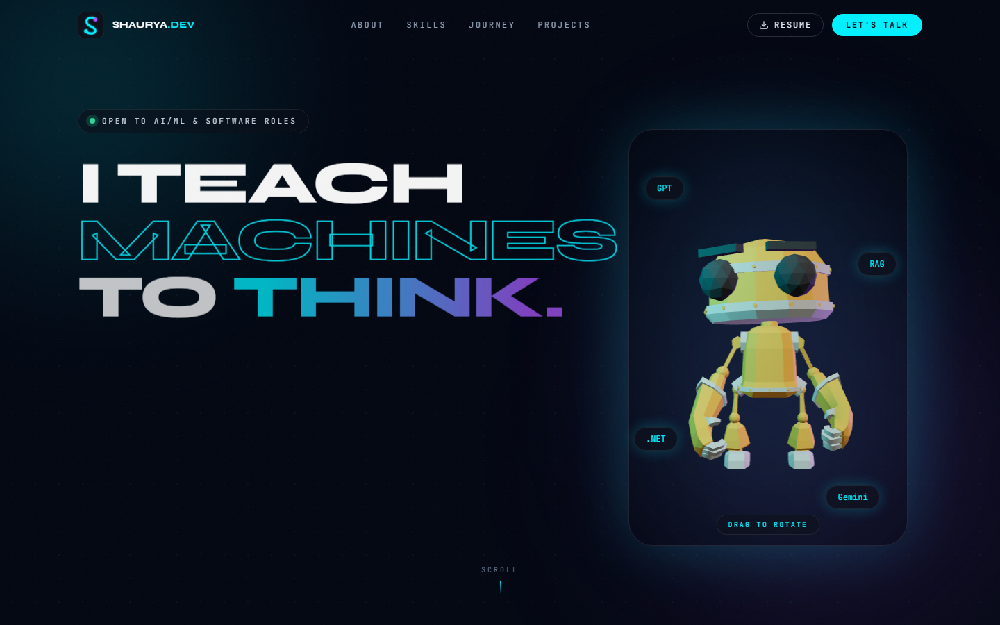

# Shaurya.dev

Personal portfolio of **Shaurya Pratap Singh**, an AI/ML engineer. Dark neon site with a 3D hero, editable content, and a contact form that emails straight to Gmail.



## What’s on the site

- Hero with a draggable 3D character, project and skill sections, experience, and achievements
- Smooth scroll, custom cursor, and a contact page
- Admin dashboard to edit copy, colors, dark/light mode, the hero character, jobs, and projects
- Inbox for contact messages, plus a simple traffic view
- Messages send from **Shaurya.dev** to the Gmail set in Admin → Inbox

## Run it

```bash
npm install
npm run dev
```

Open [http://localhost:5173](http://localhost:5173).

## Admin

Sign in at [http://localhost:5173/login](http://localhost:5173/login). The username and password live in `.env` (`ADMIN_USER`, `ADMIN_PASSWORD`). That file stays off git.

From the dashboard you can publish the whole site, switch dark and light mode, replace the hero robot, and choose which Gmail receives contact messages.

## Contact email

Mail uses Gmail. In `.env`:

```
SMTP_USER=your@gmail.com
SMTP_PASS=your-gmail-app-password
```

`SMTP_PASS` is a Google App Password from [myaccount.google.com/apppasswords](https://myaccount.google.com/apppasswords), not the normal Gmail password. The address that receives messages is changed in Admin → Inbox.
